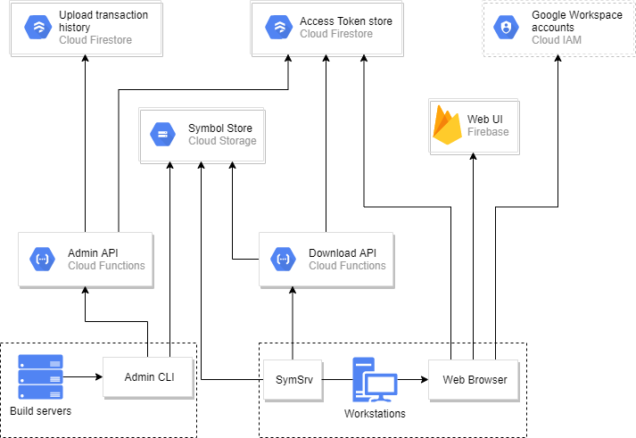

# Run a Symbol Server in GCP

# Overview

This is a [Symbol Server](https://docs.microsoft.com/en-us/windows/win32/debug/symbol-servers-and-symbol-stores) implementation. Deploy this, upload your symbol files here, and have  developers in your team use this as a one-stop shop when they want to inspect crash dumps. 

Any debuggers that use SymSrv (such as Visual Studio or WinDbg) can fetch symbols directly from this symbol server. It is built entirely using [Google Cloud Platform's serverless architecture features](https://cloud.google.com/serverless/whitepaper), which means there are no VMs or disks to manage. It offers token-based authentication and can therefore safely be exposed to the internet, even if the material is confidential. It includes a self-service web UI for managing tokens, inspecting the contents of the server, and a commandline utility + a C# API for managing the contents of the server.

# How to use

Fork this repository, configure it, and deploy it to a project in GCP.

Configure your CI platform to upload symbol files to store(s) using `cloud-symbol-server-cli`.

Tell people in your team to visit the Web UI to create their own Personal Access Tokens, and use the web UI's built-in help to configure Visual Studio correctly on their workstations.

When they need to debug a crash dump in the future, they will automatically have access to any symbols that your CI system has uploaded in the past.

# Architecture

# New deployment setup

See [NEW_DEPLOYMENT_SETUP.md](NEW_DEPLOYMENT_SETUP.md).

# Development and debugging

See [DEVELOPMENT_AND_DEBUGGING.md](DEVELOPMENT_AND_DEBUGGING.md).

# Upgrading from v0.x

v1.x is partially backwards-compatible with v0.4.0: The v0.4.0 CLI tool's `uploads create` command functions against the v1.x backend, and Visual Studio clients can continue to use their old URLs as HTTP symbol stores. However, many other v0.4.0 CLI tool commands will cease to function.

Here is how to upgrade from v0.x to v1.x:

1. Make sure that your existing service is at v0.4.0. If not, upgrade to v0.4.0 first.
2. Disable any jobs that upload to Cloud Symbol Server.
3. Deploy v1.x (`make deploy` pointing to your production environment).
4. Run the data migration step (`make run-migrate-firestore-to-postgres`, again, pointing to your production environment).
5. Verify that you still can log in to the web portal.
6. Verify that the v0.x CLI tool can upload symbols.
7. Verify that the v1.x CLI tool can upload symbols.
8. Re-enable jobs that upload to Cloud Symbol Server.
9. Update the CLI tools that you use to v1.x.

The migration step will copy all metadata from Cloud Firestore and into Postgres. After the upgrade, new metadata will be written to Postgres; the contents of Cloud Firestore will remain, but no longer be updated. The Cloud Firestore database and its contents will be deleted in the future, when v2.x comes around.
