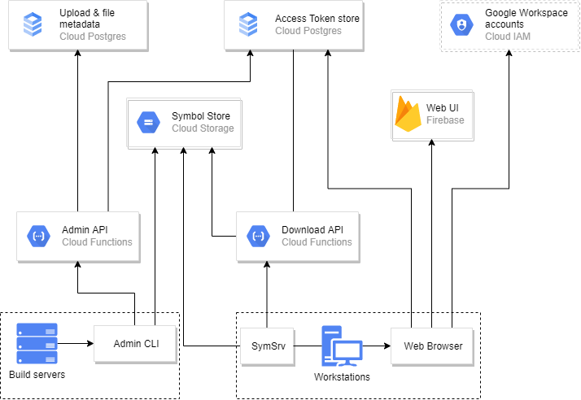

# Run a Symbol Server in GCP

# Overview

This is a [Symbol Server](https://docs.microsoft.com/en-us/windows/win32/debug/symbol-servers-and-symbol-stores) implementation. Deploy this, upload your symbol files here, and have  developers in your team use this as a one-stop shop when they want to inspect crash dumps. 

Any debuggers that use SymSrv (such as Visual Studio or WinDbg) can fetch symbols directly from this symbol server. It is built entirely using [Google Cloud Platform's serverless architecture features](https://cloud.google.com/serverless/whitepaper), which means there are no VMs or disks to manage. It offers token-based authentication and can therefore safely be exposed to the internet, even if the material is confidential. It includes a self-service web UI for managing tokens and a commandline utility + a C# API for managing the contents of the server.

# How to use

Fork this repository, configure it, and deploy it to a project in GCP.

Configure your CI platform to upload symbol files to store(s) using `cloud-symbol-server-cli`.

Tell people in your team to visit the Web UI to create their own Personal Access Tokens, and
get help with setting `_NT_SYMBOL_PATH` correctly on their workstations.

When they need to debug a crash dump in the future, they will automatically have access to
any symbols that your CI system has uploaded in the past.

# Architecture

# Setup and teardown

See [SETUP_AND_TEARDOWN.md](SETUP_AND_TEARDOWN.md).

# Debugging and Development

See [DEBUGGING_AND_DEVELOPMENT.md](DEBUGGING_AND_DEVELOPMENT.md).
